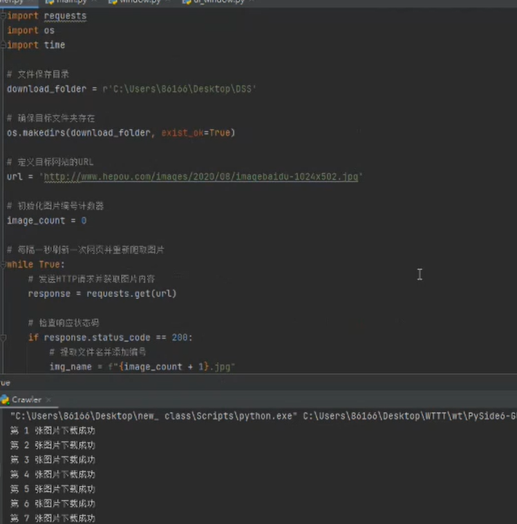
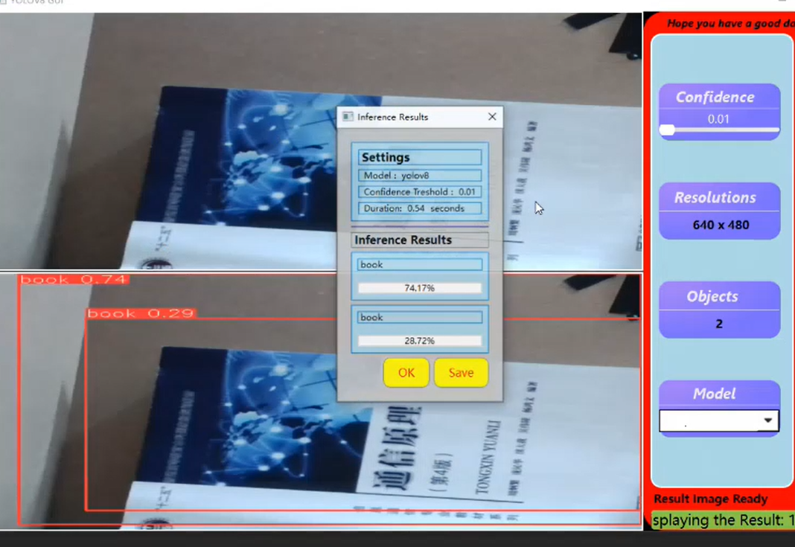


#	IOT

	Hello, here is the source code section of the IoT
## main tasks

 1. Use **python crawler** to fetch images from e-commerce pages
 2. Object recognition using **YOLO** technology
 3. Upload data to the e-commerce database

## Install the necessary dependencies
Before you can run the Python script, you must install the necessary modules :

 - `ultralytics`
 - `PySide6`
 - `sahi`
 
Here is the general flow chart

## How to start
At first, your computer and the database host computer  **MUST**  connect the Wi-Fi of the small car.

Run the code
 - `Crawler.py`

You must change the **path** where the file is saved here

**Later**

Run the code
 - `main.py`

Select the image you want to detect 
**Final step**
Save the file to the local PC and log in to the website to upload it

