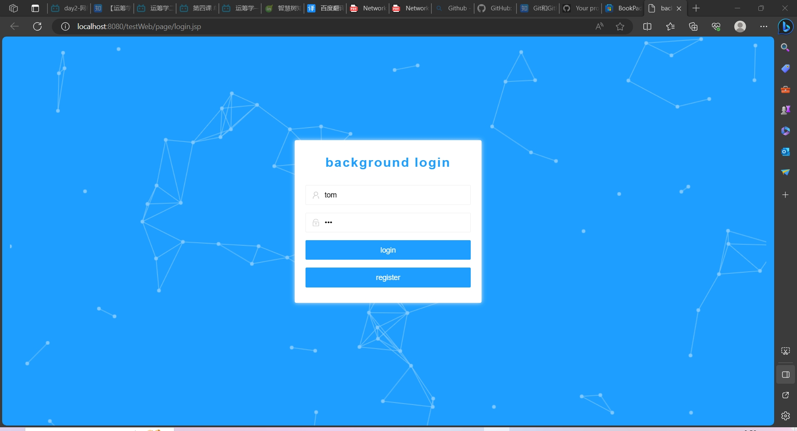
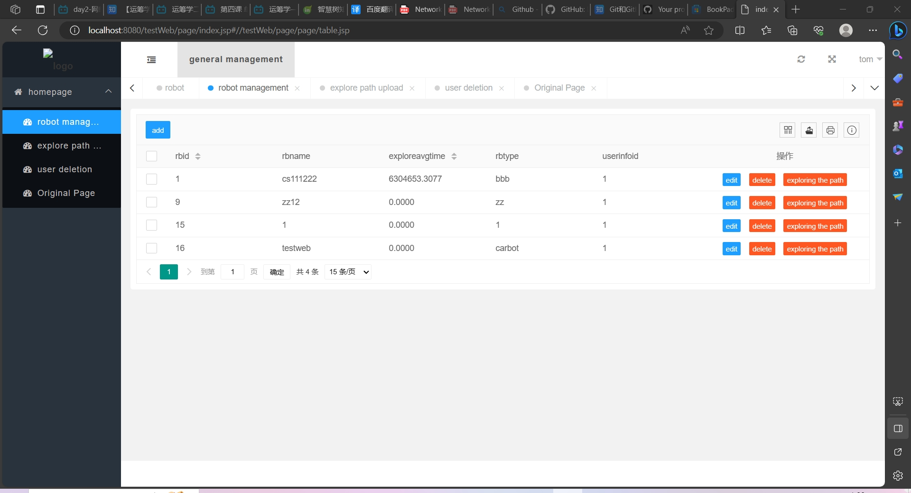
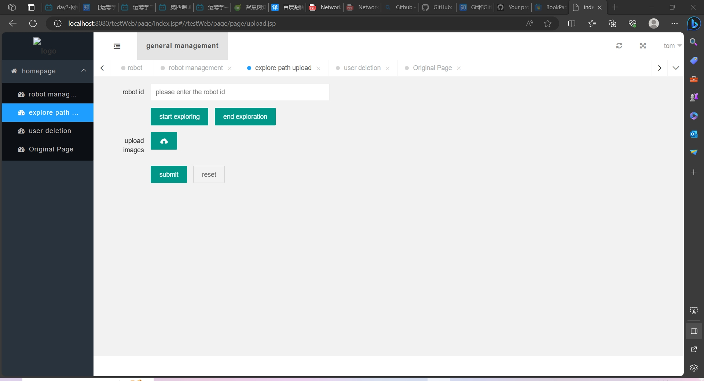
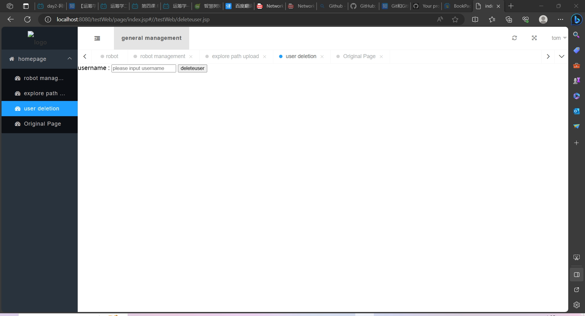

# Java Web Program
 In order for you to better use our program, we will introduce the usage methods of our program.
 
* **Development environment**
The development environment for this project is IntelliJ IDEA  (JDK19), as well as TomCat8.5 server and MySQL workbench 8.0

* **Remote connection**
When someone else's host is on the same LAN as the server's host, they can enter their IPv4 address and port in their browser to access our website. Such as 192.168.43.171:8080/testWeb/page/login.jsp

* **Function Introduction**

You can click "**register**" to register an account,then click "**login**",nter your account and password to access the website,to enter our website.

Then you enter the home page like that:

In robot managment,you can: 
Add robot by the "**add**" buttom at left top corner.
Modify the specific information of the robot by the "**edit**" buttom.
Delete robot by the "**delete**" buttom.
View the exploration path of the car by "**exploring the path**". 

Enter **robotID** to choose robot you want,then click "**start exploring**" to start,click "**end exploration**" to end. You can **upload** the selected image on your computer. Finally ,just **submit** and you can see the record in robot managment.

You can cancel your account in **user delection**.Enter you username then click "**deleteuser**".

Original page is the page we made before,keep it for reference only for later modifications and has no practical effect

# This is all about the introduction of our program application. 
# Thank you for reading :) !!!

